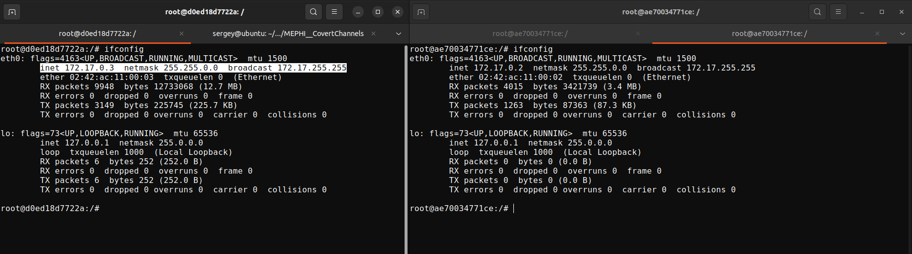
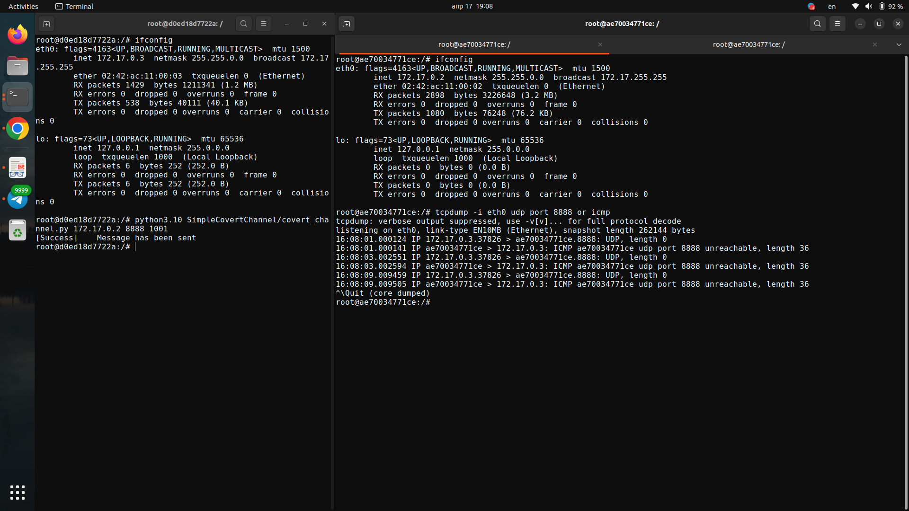
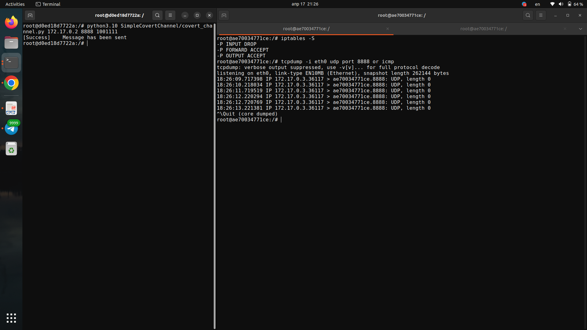

# ЛР №3. Методы противодействия утечке информации по сетевым скрытым каналам
|           |                                                                                            |
| --------- | ------------------------------------------------------------------------------------------ |
| Вариант   | 12                                                                                         |
| Модель    | Модель 2. Пакеты фиксированной длины передаются в случайные моменты времени                |
| Пример    | Пример 7. Простейший скрытый канал, основанный на изменении скоростей передаваемых пакетов |

**Дисциплина:** "Защита информации от утечки по скрытым каналам".
**Цель:** Целью данной лабораторной работы является изучение способов противодействия утечке информации по сетевым скрытым каналам.

В рамках данной работы будет разработанно примитивное средство защиты от организации скрытого канала по времени.


## Описание скрытого канала
В простейшем скрытом канале по времени, основанным на изменении скоростей передаваемых пакетов подразумевается, что информация кодируется посредством прибытия/отсутствия пакета в течение каждого временного интервала *Δt*.

Например:
```
Пример передачи сообщения «10011010»:

client -->  | pkt | --- | --- | pkt | pkt | --- | pkt | --- | --> server
             <---> <---> <---> <---> <---> <---> <---> <--->
               t     t     t     t     t     t     t     t
```

В примере выше если за интервал времени *Δt* был отправлен пакет, то считается, что пришла "1", если - нет, то пришел "0".


## Описание стенда
В лабораторной работе будет использовано два *docker*-контейнера: *client_a* - устройство с закладкой, с *ip*-адреса этого контейнера будут отправляться сообщения по скрытому каналу; *client_b* - сервер с встроенным средством защиты; в качестве встроенного средства защиты на сервере будет работать *iptables*. *ID* и имя каждого из контейнеров, в качестве образов использовался *ubuntu 22.04*:
```console
$ sudo socker ps -a
CONTAINER ID   IMAGE     NAMES
ae70034771ce   ubuntu    client_b
d0ed18d7722a   ubuntu    client_a
```

Важно, для работы *iptables* на каждом из контейнеров необходимо выдать права *--cap-add=NET_ADMIN*, также для сервера необходимо куда-нибудь примонтировать папку с программным средством, реализующим скрытый канал из ЛР№1. Для запуска контейнеров использовались следующие команды:
```console
$ sudo docker run --cap-add=NET_ADMIN -v "/home/sergey/Documents/InfoSec/MEPHI__CovertChannels/SimpleCovertChannel/:/SimpleCovertChannel/" --name client_a -it ubuntu
$ sudo docker run --cap-add=NET_ADMIN --name client_b -it ubuntu
```

Оба контейнера будут по умолчанию видеть друг друга в сети, их *IP*-адреса:


Следующим шагом, с использованием консольной утилиты *tcpdump* выясним, каким образом *client_b* реагирует на приходящий *udp*-трафик. Для фильтрафции трафика в *tcpdump* использовалась команда `tcpdump -i eth0 udp port 8888 or icmp`. Видим, как по умолчанию сервер реагирует на каждую пришедшую дейтаграмму *ICMP*-ответом:


Теперь на сервере применим политику *DROP* для цепочки *INPUT* `iptables -P INPUT DROP` и убеждаемся в том, что теперь ко всему входящему трафику применяется политика *DROP*:


После чего применим политику *ACCEPT* по лимитам `iptables -A INPUT -p udp -m limit --limit 1/m -j ACCEPT`, эта команда будет говорить о том, что *iptables* применит параметр *--limit-burst 5* (по умолчанию 5, поэтому он не указывается в правиле) и *--limit 1/m* - скорость, с которой уменьшается счетчик *burst limit* для всех *udp*-дейтаграмм:


Так, в работе продемонстрирован примитивный способ защиты от скрытого канала по времени, после 4 пакета *iptables* начинает отбрасывать входящие пакеты. Для упрощения стенда *iptables* работал на сервере, но рекомендуется вынести средство защиты в качестве отдельного устройства которое будет перенаправлять трафик от источника к адресату. Так в случае если злоумышленник имеет возможность прослушивать трафик на сервере,  но не имеет возможности делать этого на внешнем средстве защиты - он не сожет получить сообщение по скрытому каналу.


## Заключение
Разработанное средство защиты служит больше для демонстрации принципа того, как можно манипулировать трафиком, чтобы присечь нежелательную активность, например, подобный подход может применяться для защиты от *syn-flood*-атак. Предложенный подход может сильно снижать пропускную способность канала. Для защиты же от передачи информации по скрытым каналам необходимо разрабатывать более совершенные средства защиты, с использованием подходов по статическому анализу, машинному обучению и пр. 
