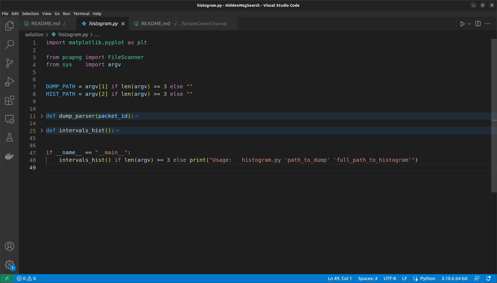
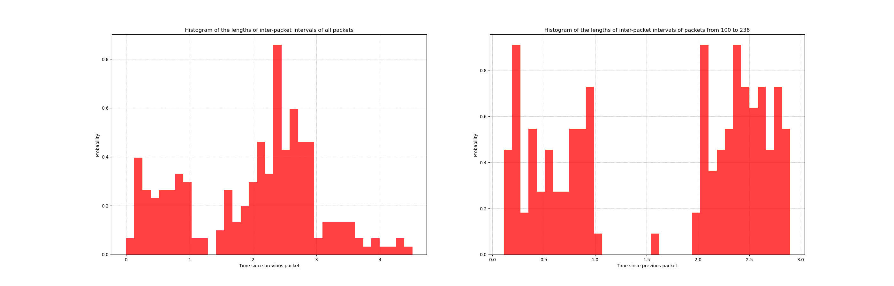
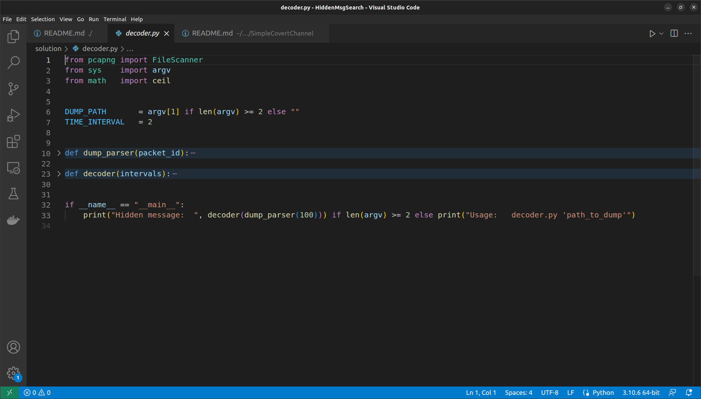

# ЛР №2. Поиск скрытого сообщения в потоке трафика 
|           |              |
| --------- | ------------ |
| Вариант   | 1            |

**Дисциплина:** "Защита информации от утечки по скрытым каналам"
**Цель:** Целью данной лабораторной работы является изучение метода обнаружения сетевых скрытых каналов по времени, основанных на изменении длин межпакетных интервалов.

В рамках данной лабораторной работы будет построена гистограмма отсортированных по возрастанию длин межпакетных интервалов и определено значение вероятности присутствия скрытого канала в системе и разработано средство декодирования скрытого сообщения.


## Задания 1, 2
**Задание 1,2:** необходимо построить гистограмму отсортированных по возрастанию длин межпакетных интервалов (для всех пакетов и для пакетов, начиная с 100) и определить значение вероятности присутствия скрытого канала в системе согласно формуле:
```math
P = 1 - \lim_{N\to\infty} \frac{C_{\mu}(N)}{C_{max}(N)}
```

Для построения гистограммы отсортированных по возрастанию длин межпакетных интервалов в языке программирования *Python* использовалась библиотека *matplotlib*. На рисунке ниже приведена структура программы для построения двух гистограмм (для всех пакетов и начиная только с 100 пакета):


Так для первой гистограммы:
```math
P = 1 - \lim_{N\to\infty} \frac{C_{\mu}(N)}{C_{max}(N)} = 1 - \frac{5}{20} = 0.75
```

Для второй гистограммы (отображены только межпакетные интервалы, начиная с 100):
```math
P = 1 - \lim_{N\to\infty} \frac{C_{\mu}(N)}{C_{max}(N)} = 1 - \frac{1}{13} = 0.92
```

Для парсинга пакетов использовалась библиотека *pcapng* для языка программирования *Python*. Ниже представлены сниппеты кода ф-ий *dump_parser(packet_id)* для парсинга *pcap*-файла и *intervals_hist()* для отрисовки самих гистограмм:
```python
def dump_parser(packet_id):
    ...
    for idx in range(packet_id, len(packets) - 1):
        try:
            intervals.append(packets[idx].timestamp - packets[idx - 1].timestamp)
        except AttributeError as e:
            pass
    ...

def intervals_hist():
    ...
    plt.hist(dump_parser(100), 35, density = 1, facecolor = 'r', alpha = 0.75)
    ...
```

В результате получаются следующие гистограммы. Слева - для всех пакетов, справа - для покетов, начиная с 100. На правом рисунке можно увидеть, как получается два интервала, образующие скрытый канал:



## Задание 3 
**Задание 3:** разработать средство декодирования скрытого сообщения и определить, какое скрытое сообщение было передано.

Для разработки средства декодирования скрытого сообщения в языке программирования *Python* аналогично используется библиотека *pcapng*. Ниже представлены сниппеты кода ф-ий *dump_parser(packet_id)* для парсинга *pcap*-файла и *intervals_hist()* для декодирования сообщения, полученного по скрытому каналу. Ф-ия *dump_parser(packet_id)* похожая на аналогичную ф-ию из модуля для отрисовки гистограмм и *decoder(intervals)* для реализации логики декодирования полученного сообщения:


Сниппеты кода по каждой из ф-ий, *decoder(intervals)* в зависимости от того, какой интервал рассматривается добавляет к переменной *message* *0* либо *1* до тех пор пока не будут рассмотрены все межпакетные интервалы, после чего полученная последовательность бит преобразуется в последовательность байт:
```python
def dump_parser(packet_id):
    ...
    for idx in range(packet_id, len(packets) - 1):
        try:
            intervals.append(packets[idx].timestamp - packets[idx - 1].timestamp)
        except AttributeError as e:
            pass

    return intervals

def decoder(intervals):
    message = ""

    for interval in intervals:
        message += str(ceil(max(interval - TIME_INTERVAL, 0)))
    
    return bytes.fromhex(hex(int(message, 2))[2:]).decode("utf-8")
```

Результат работы `decoder.py` при значении *TIME_INTERVAL = 2*:
```console
$python3 solution/histogram.py dump/1.pcapng histograms/histogram_x.png
Hidden message:   some_cc_ez_2_dtct
```

## Заключение
Рассматриваемый в работе метод обнаружения скрытого канала может быть успешно применен, в случае если обем передаваемого трафика сравним с обемом легитимного трафика, передаваемого по каналу свзяи. В случае если объем легитимного трафика будет большим, то обнаружение скрытого канала связи будет затруднено. Для обнаружения скрытого канала при большом объеме трафика и при малом объеме передаваемого сообщения могут использоваться различные методы сравнения тестируемой выборки с «эталонной», например для сравнения выборок могут применяться известные методы математической статистики (например, критерий Колмогорова-Смирнова и критерий Пирсона). Также для поиска закономерностей по такой характеристике трафика как межпакетный интервал могут применяются специально разработанные методы, например, отдельно выделяется область методов обнаружения на основе алгоритмов машинного обучения.

В случае мультисимвольные скрытых каналов предложенный в лабораторной работе метод аналогичныым образом будет давать положительные результаты и помогать при обнаружении скрытых каналов. Так для 3-символьного скрытого канала на гистограмме будет явным образом видно 3 пика с максимальным числом переданных пакетов (или 3 группы межпакетных интервалов) вместо двух для бинарного скрытого канала.