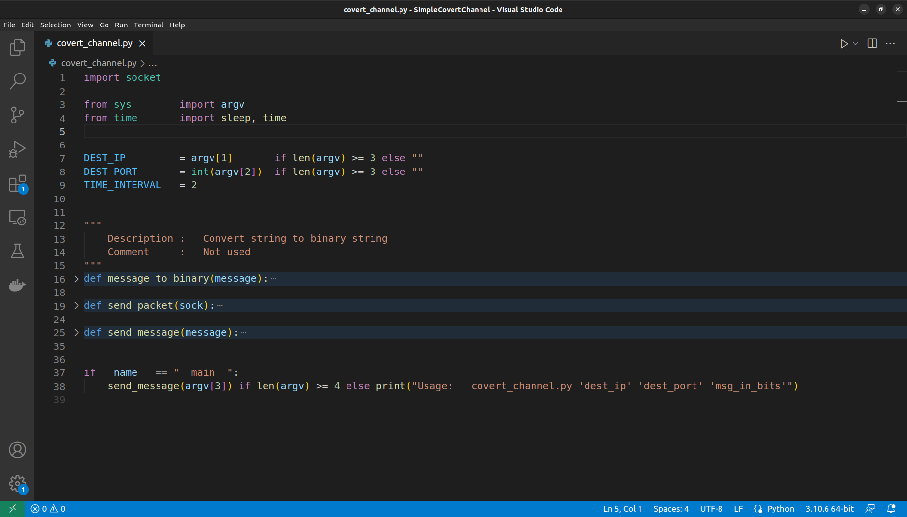
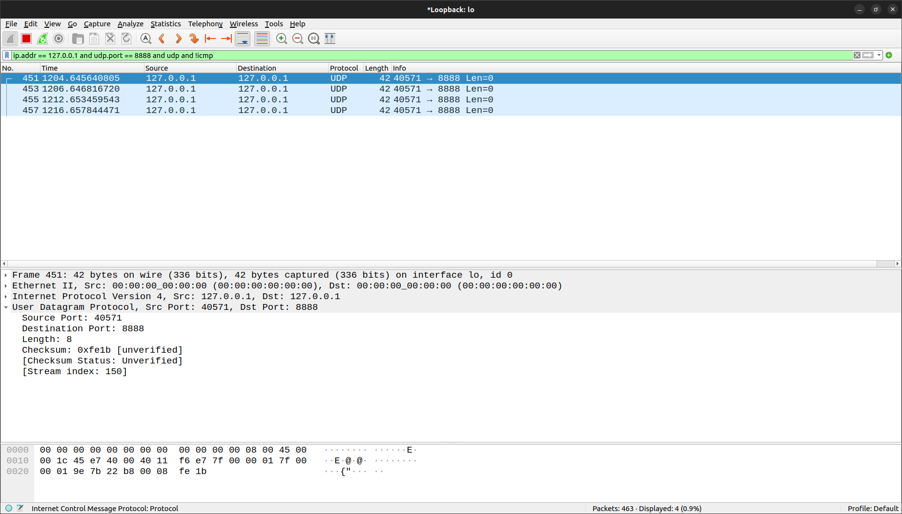

# ЛР №1. Способы построения скрытых каналов
|           |                                                                                            |
| --------- | ------------------------------------------------------------------------------------------ |
| Вариант   | 12                                                                                         |
| Модель    | Модель 2. Пакеты фиксированной длины передаются в случайные моменты времени                |
| Пример    | Пример 7. Простейший скрытый канал, основанный на изменении скоростей передаваемых пакетов |


**Дисциплина:** "Защита информации от утечки по скрытым каналам"
**Цель:** Целью данной лабораторной работы является изучение способов построения скрытых каналов.

В рамках данной работы будет реализован скрытый канал, с штаной моделью передачи информации, подразумевающей, что пакеты фиксированной длины передаются в случайные моменты времени. Сам скрытый канал будет основан на изменении скоростей передаваемых пакетов.


## Описание скрытого канала
В простейшем скрытом канале по времени, основанным на изменении скоростей передаваемых пакетов подразумевается, что информация кодируется посредством прибытия/отсутствия пакета в течение каждого временного интервала *Δt*.

Например:
```
Пример передачи сообщения «10011010»:

client -->  | pkt | --- | --- | pkt | pkt | --- | pkt | --- | --> server
             <---> <---> <---> <---> <---> <---> <---> <--->
               t     t     t     t     t     t     t     t
```

В примере выше если за интервал времени *Δt* был отправлен пакет, то считается, что пришла "1", если - нет, то пришел "0".


## Описание реализации 
Для отправки *udp*-дейтаграмм использовалась библиотека *socket* в языке программирования *Python*. Для реализации механизма отправки дейтаграмм с задержкой *TIME_INTERVAL* использовались ф-ии *sleep()* и *time()* из библиотеки *sleep()*. На рисунке ниже приведена структура программы, реализующей скрытый канал:


Ниже представлен сниппет кода с реализацией логики отправки сообщения по скрытому каналу. Ф-ия *send_packet(sock)* отправляет одну *udp*-дейтаграмму и выполняет задержку на временной промежутой *TIME_INTERVAL* (с учетом времени, необходимого на отправку дейтаграммы). Ф-ия *send_message()* принимает строку формата "0101010001..." и итеративно, в зависимости от того, какой символ "0" или "1" рассматривается на итерации, шлет отправителю *udp*-дейтаграмму либо выполняет задержку на величину *TIME_INTERVAL*:
```python
def send_packet(sock):
    initial_time = time()
    sock.sendto(bytes(), (DEST_IP, DEST_PORT))

    sleep(TIME_INTERVAL - (time() - initial_time))

def send_message(message):
    sock = socket.socket(socket.AF_INET, socket.SOCK_DGRAM)

    # Send the initial packet, it will indicate that the message transmission has begun
    sock.sendto(bytes("initial packet"), (DEST_IP, DEST_PORT))

    for bit in message:
        sleep(TIME_INTERVAL) if bit == '0' else send_packet(sock)
```

Важно отметить, что перед тем, как начинать передачу сообщения осуществляется отправка инициализирующей *udp*-дейтаграммы. Это необходимо, т.к. если этого не сделать, то при отправке сообщения с некторым кол-ом *0*-битов в начале, например "0000011001110", первые пять *0*-битов потеряются при декодировании сообщения.


## Передача сообщения по скрытому каналу
Для демонстрации работы предлагаемого скрытого канала будет отправлено сообщение *"100101"* на *8888* порт *lohalhost*. Проверка интервалов с которыми будут приходить *udp*-дейтаграммы будет осуществляться при помощи *wireshark*.

Фильтр для просмотра только *udp*-дейтаграмм на *localhost* на порту *8888*:
```
ip.addr == 127.0.0.1 and udp.port == 8888 and udp and !icmp
```

Команда для отправки сообщения по скрытому каналу с использованием написанной программы, также важно, что в примере ниже программа будет запускаться с *TIME_INTERVAL = 2*:
```python
python3 SimpleCovertChannel/covert_channel.py 127.0.0.1 8888 100101
```

Как итог, полностью подтверждается ожидаемое поведение программы, каждая дейтаграмма приходит в свой временной промежуток:



## Заключение
В рамках лабораторной работы был разработан стенд, имитирующий информационное взаимодействие двух пользователь по разрешенному каналу связи. В качестве способа для отправки *udp*-дейтаграмм использовалась библиотека *socket* в языке программирования *Python*. Для проверки работоспособности предложенного скрытого канала использовался *wireshark*. Также в ходе лабораторной работы был снят дамп трафика во время передачи пакета.